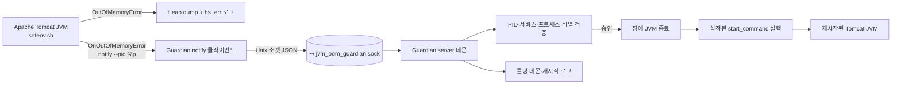

# jvm-oom-guardian

[](https://github.com/playok/jvm-oom-guardian/actions/workflows/ci.yml) [](https://github.com/playok/jvm-oom-guardian/releases) [](LICENSE)

[English](README.md)

Java JVM의 `OutOfMemoryError`를 감지하고, 로컬 Unix 도메인 소켓으로 외부 데몬에 통지해 장애 JVM을 종료한 뒤 Tomcat 서비스를 재시작하는 경량 가디언입니다.

## 빌드와 실행

```bash
./scripts/build.sh
cp config.example.json ~/.jvm_oom_guardian.json
./bin/jvm-oom-guardian server start --config ~/.jvm_oom_guardian.json
./bin/jvm-oom-guardian server status --config ~/.jvm_oom_guardian.json
```

중지는 `server stop`을 사용합니다. 중지 시 데몬 PID 파일과 소켓을 정리합니다.

## JVM 설정

```text
-XX:+HeapDumpOnOutOfMemoryError
-XX:HeapDumpPath=/var/lib/tomcat/oom
-XX:OnOutOfMemoryError='/usr/local/bin/jvm-oom-guardian notify --service my-tomcat --pid %p'
```

`notify`는 기본적으로 `~/.jvm_oom_guardian.sock`에 JSON 이벤트를 전송합니다. 데몬은 PID 소유자를 확인하고 해당 프로세스를 종료한 후 설정된 `start_command`를 실행합니다.

### Apache Tomcat `setenv.sh` 설정 예시

`$CATALINA_BASE/bin/setenv.sh`를 만들고 Tomcat 실행 사용자가 힙 덤프 디렉터리에 쓰기 권한을 가지며 guardian 소켓에 접근할 수 있도록 설정합니다.

```bash
#!/usr/bin/env bash
set -euo pipefail

OOM_DIR="/var/lib/tomcat/oom"
mkdir -p "$OOM_DIR"

export CATALINA_OPTS="${CATALINA_OPTS:-} \\
  -XX:+HeapDumpOnOutOfMemoryError \\
  -XX:HeapDumpPath=$OOM_DIR \\
  -XX:OnOutOfMemoryError='/usr/local/bin/jvm-oom-guardian notify --service my-tomcat --pid %p'"
```

Tomcat을 시작하기 전에 동일한 사용자로 guardian 데몬을 먼저 실행해야 합니다. 기본값이 아닌 소켓을 사용한다면 notify 명령에 `--socket /path/to/.jvm_oom_guardian.sock`을 추가하세요. `%p`는 JVM이 장애 프로세스 PID로 치환하므로 그대로 유지해야 합니다.

## 프로그램 구조



데몬은 JVM 외부에서 실행되므로 OOM으로 JVM이 종료된 뒤에도 서비스를 재시작할 수 있으며, 장애 순간 Tomcat 내부 기능에 의존하지 않습니다.

## 설정 및 로그

`config.example.json`에서 소켓, PID 파일, 재시작 명령, 로그 디렉터리와 파일 패턴, 보관 기간 및 최대 파일 수를 설정할 수 있습니다. 로그는 날짜 기반 롤링과 오래된 파일 정리를 지원합니다.

## 테스트

```bash
./scripts/test.sh
# 로컬 GoReleaser 산출물만 생성
make release-snapshot
```

정식 릴리스는 Go 태그를 만든 뒤 `make release`를 실행합니다. GoReleaser가 Linux, macOS, Windows용 amd64 바이너리와 Linux/macOS arm64 바이너리를 각각 압축해 생성합니다. 자세한 장애 재현 절차는 [`testdata/SCENARIO.md`](testdata/SCENARIO.md)를 참고하세요.

GitHub Release에 파일을 자동으로 올리려면 버전 태그를 푸시하세요.

```bash
git tag v1.0.0
git push origin v1.0.0
```

GitHub Actions가 GoReleaser를 실행해 각 플랫폼 압축 파일과 `checksums.txt`를 Release의 Assets에 첨부합니다.
